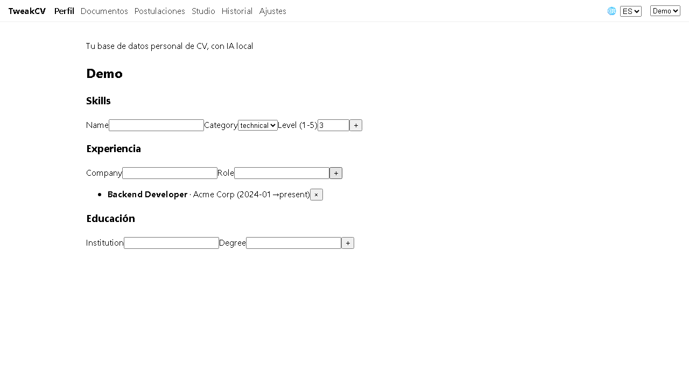
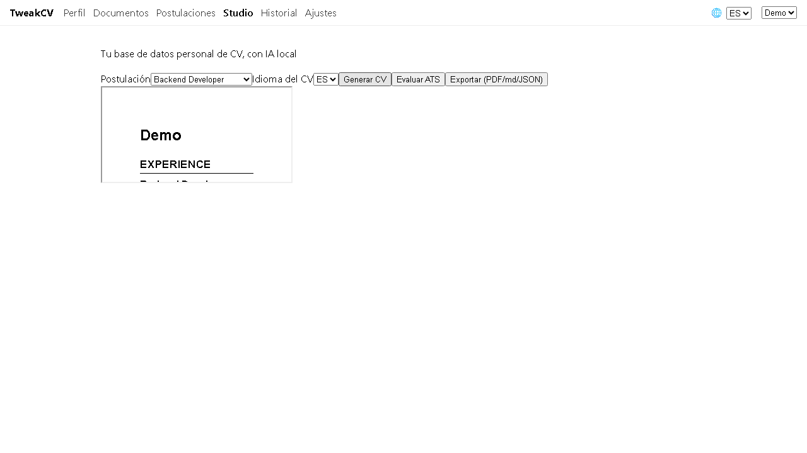
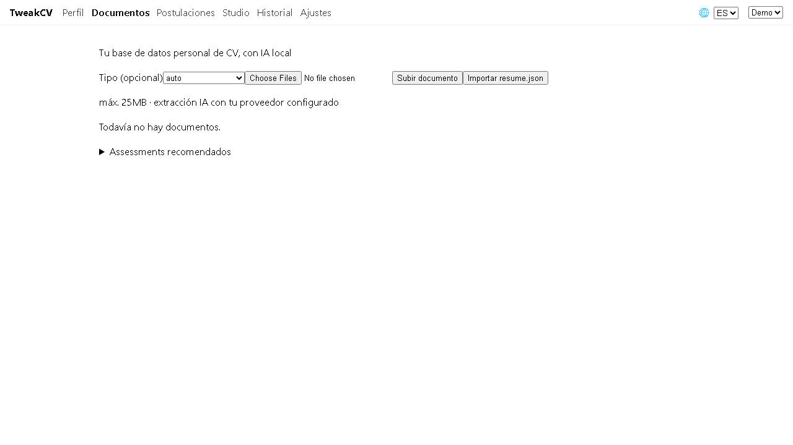
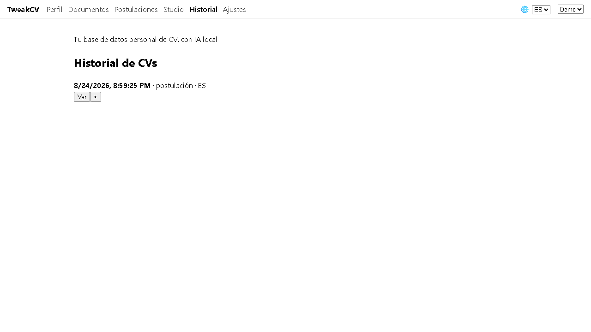

# tweakcv

Local open-source app to build your personal CV database and generate ATS-optimized tailored CVs with your own AI.

Your data never leaves your machine — the only network traffic is the AI calls to the provider you configure (OpenAI, Groq, OpenRouter, Ollama, LM Studio, or any OpenAI-compatible endpoint). A deterministic `mock` provider is included so everything works offline.

| Perfil | Studio (preview + export) |
| --- | --- |
|  |  |

| Documentos (ingesta IA) | Evaluación ATS en Historial |
| --- | --- |
|  |  |

## Requirements

- Node.js >= 22 LTS
- ~600 MB disk (dependencies + headless Chrome downloaded on first install)

## Quickstart

```bash
npm install
npm run dev
```

Open http://localhost:5173. On first launch create your profile, then configure your AI provider in **Ajustes** (preset `mock` works offline out of the box).

## What it does

1. **Perfil** — multi-profile database: experiences, education, skills (technical/soft/languages with CEFR), projects.
2. **Documentos** — drop diplomas, certificates or old CVs; the AI extracts structured data; you review in a Notion-style grid + slide-over; import only what you approve via a field-by-field diff.
3. **Postulaciones** — paste a job posting (or upload an image); AI parses requirements & keywords; editable.
4. **Studio** — generate a tailored CV from a posting against your profile snapshot; live HTML preview; export PDF / Markdown / JSON Resume (validated against the official schema).
5. **Historial** — every generation is an immutable snapshot; evaluate with a hybrid ATS score (60% deterministic engine + 40% AI rubric), iterate from suggestions as parent/child versions.

## Production mode

```bash
npm run build
npm start
```

Serves everything from a single process at http://localhost:3001 (override with `PORT`).

## Commands

| Command | Description |
| --- | --- |
| `npm run dev` | API (:3001) + Vite dev server (:5173) with hot reload |
| `npm run build` | Build client to `dist/client` |
| `npm start` | Serve built app + API from one process |
| `npm test` | Unit + integration tests (Vitest) |
| `npm run test:e2e` | End-to-end tests (Playwright, dedicated ports 3101/5199) |
| `npm run lint` | ESLint |
| `npm run typecheck` | TypeScript strict check |
| `npm run bench` | Performance gates (SC-008): ops <1s, export <10s |
| `node --import tsx scripts/privacy-audit.ts` | Verify api_key never leaks to logs/db/diagnostics |

## Where your data lives

Everything is stored locally under `data/` (gitignored): SQLite database, uploaded documents, logs, exports and your AI credentials (`data/credentials.json`). Zero telemetry — see [SECURITY.md](SECURITY.md).

## Development

```bash
git clone https://github.com/tweakcv/tweakcv.git
cd tweakcv
npm install
npm run dev
```

Project workflow, decisions (ADRs) and issue tracking live in [.issues/index.md](.issues/index.md). Spec kit artifacts under [specs/](specs/001-tweakcv-mvp/) and `.specify/`.

See [CONTRIBUTING.md](CONTRIBUTING.md).

## License

Distributed under the terms of the [LICENSE](LICENSE) file.
